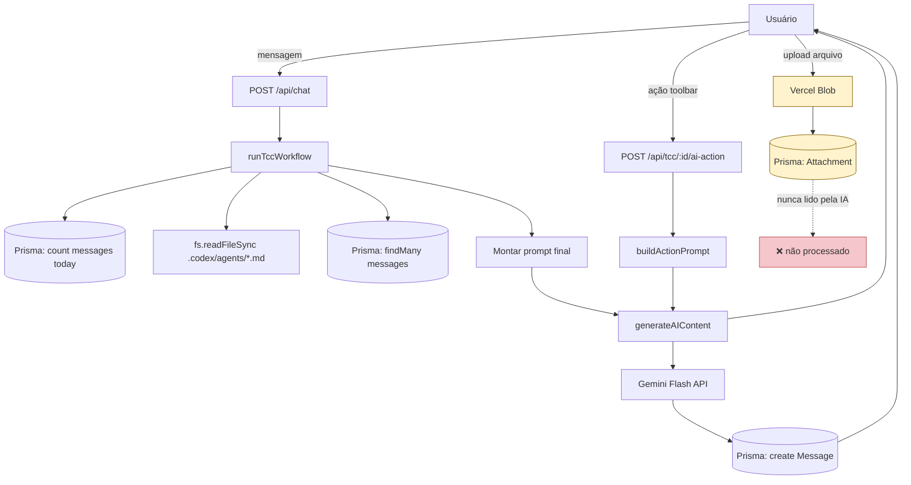

# 02 — Arquitetura Atual da Camada de IA

## Componentes identificados na auditoria

### 1. Provider de IA — `src/lib/ai/provider.ts`

Abstração fina que centraliza a chamada ao modelo de linguagem.
Suporta `'gemini'` e tem stub preparado para `'gpt'` (não implementado no beta).

```
generateAIContent(prompt: string, provider: 'gemini' | 'gpt') → string
```

Chama `callGemini()` de `src/lib/gemini.ts`.

---

### 2. Wrapper Gemini — `src/lib/gemini.ts`

Chamada HTTP direta à API REST do Gemini:
```
POST https://generativelanguage.googleapis.com/v1beta/models/gemini-flash-latest:generateContent
```

Parâmetros fixos:
- `temperature: 0.1` (baixíssima — favorece determinismo acadêmico)
- `maxOutputTokens: 2000`

Contém também `chatAgent()` com prompts embutidos para os papéis `bibliotecario`,
`arquiteto` e `redator` — função legada, não usada pelo fluxo principal atual.

---

### 3. Orquestrador de Workflow — `src/lib/agents/aiox-integration.ts`

Função central: `runTccWorkflow(userId, tccId, message, plan)`.

Responsabilidades:
1. **Validação de limite diário** — conta mensagens `role: bot` do dia via Prisma.
2. **Seleção de agente** — mapeia plano para `redator-free`, `redator-pro` ou `redator-vip`.
3. **Carregamento de system prompt** — lê arquivo `.codex/agents/{agentId}.md` via `fs.readFileSync`,
   extrai a seção `## System Prompt`.
4. **Injeção de histórico** (Context Injection):
   - FREE: sem histórico.
   - PRO: últimas 3 mensagens do TCC (`prisma.message.findMany`, `take: 3`).
   - VIP: todas as mensagens do TCC (`prisma.message.findMany`, sem limit).
5. **Montagem do prompt final**: `systemPrompt + contextStr + guardrails + mensagem do usuário`.
6. **Chamada ao modelo** via `generateAIContent`.
7. **Persistência** da resposta como `Message` no Prisma com `role: bot`.

---

### 4. Guardrails de Ações — `src/lib/agents/guardrails.ts`

Função: `buildActionPrompt(action, userPlan, text, context)`.

Monta prompts para as 4 ações da toolbar:
- `revisar` — revisão gramatical (PRO) ou crítica profunda (VIP)
- `abnt` — ajuste de norma ABNT (VIP)
- `citacoes` — melhoria de citações autor-data (VIP)
- `proximopasso` — orientação de próximo passo (VIP)

Não há retrieval. O texto do documento é injetado diretamente no prompt.

---

### 5. Rota de Chat — `src/app/api/chat/route.ts`

`POST /api/chat` — recebe `{ tccId, message, devPlanOverride }`,
resolve o plano e chama `runTccWorkflow`. Sem lógica de IA própria.

---

### 6. Rota de AI Actions — `src/app/api/tcc/[id]/ai-action/route.ts`

`POST /api/tcc/[id]/ai-action` — recebe `{ action, text, context, devPlanOverride }`,
bloqueia FREE, chama `buildActionPrompt` → `generateAIContent`. Não persiste a resposta
na tabela `Message` — retorna diretamente ao frontend para inserção pelo usuário.

---

### 7. Agentes como Arquivos — `.codex/agents/`

System prompts armazenados como arquivos Markdown:
- `redator-free.md`, `redator-pro.md`, `redator-vip.md` — agentes de escrita
- `orchestrator.md`, `anti-plagio.md`, `architect.md`, `bibliotecario.md` — agentes
  definidos mas **não chamados pelo código de produção atual**

O arquivo `.codex/workflows/tcc-generation.yaml` descreve um workflow com 3 fases
(Validation → Generation → Quality), incluindo checagem anti-plágio e cálculo de progresso,
mas estas fases não estão implementadas em `runTccWorkflow`. O YAML é um documento de design,
não código executado.

---

### 8. Anexos — `src/app/api/tcc/[id]/attachments/`

Arquivos enviados pelo usuário (PDF, DOC, DOCX) são salvos no Vercel Blob.
A URL e metadados ficam na tabela `Attachment` no Postgres.

**Os arquivos nunca são lidos, processados, chunkeados ou injetados no contexto da IA.**
Eles existem apenas como referências para o usuário visualizar no sidebar.

---

## Fluxo ponta a ponta (geração via chat)

```
Usuário envia mensagem no workspace
        │
        ▼
POST /api/chat
  ├─ auth() → valida sessão
  ├─ resolvePlan() → FREE | PRO | VIP
  └─ runTccWorkflow(userId, tccId, message, plan)
        │
        ├─ 1. prisma.message.count(today) → valida limite diário
        │
        ├─ 2. plan → agentId (redator-free/pro/vip)
        │
        ├─ 3. fs.readFileSync(.codex/agents/{agentId}.md)
        │      → extrai systemPrompt
        │
        ├─ 4. prisma.message.findMany(tccId)
        │      FREE: nenhum
        │      PRO:  últimas 3 mensagens
        │      VIP:  todas as mensagens
        │      → monta contextStr
        │
        ├─ 5. prompt = systemPrompt + contextStr + guardrails + message
        │
        ├─ 6. generateAIContent(prompt, 'gemini')
        │      └─ callGemini(prompt)
        │            └─ POST generativelanguage.googleapis.com
        │
        ├─ 7. prisma.message.create({ role: 'bot', content })
        │
        └─ return { id, content, agent, timestamp }
```

---

## Fluxo das AI Actions (revisar / abnt / citacoes / proximopasso)

```
Usuário clica ação na toolbar
        │
        ▼
POST /api/tcc/[id]/ai-action
  ├─ auth() → valida sessão
  ├─ plano FREE → 403 bloqueado
  ├─ buildActionPrompt(action, plan, text, context)
  │      → prompt específico por ação + guardrails
  ├─ generateAIContent(prompt, 'gemini')
  └─ return { success, result }
        │
        ▼
Frontend insere resultado no editor
(não persiste em Message)
```

---

## Diagrama Mermaid — Arquitetura atual



---

_Próximo: [03 — Veredito da Auditoria](03-rag-audit-verdict.md)_
